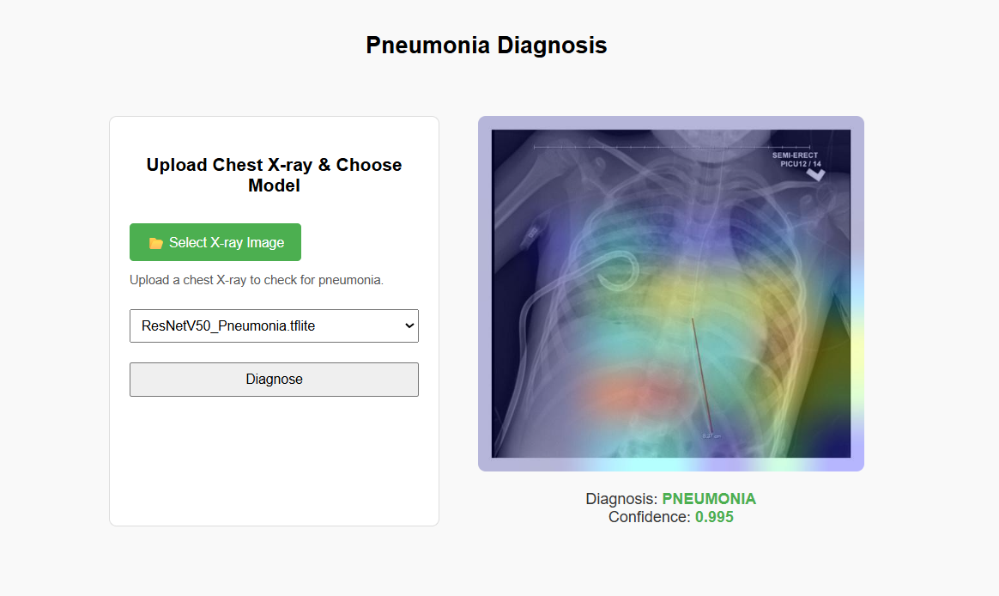

# 🩻 Chest X-ray Pneumonia Detection

This Flask web app allows users to upload chest X-ray images and detect Pneumonia using a pre-trained deep learning model in TensorFlow Lite format.

##  Features

- Upload a patient's chest X-ray image
- Select a model from a list of available `.tflite` models
- Perform inference using the selected model

## 📂 Folder Structure


## 🚀 How to Run Locally

### 1. Clone this Repository
```bash
git clone https://github.com/elaanba/Pneumonia_Detection.git
cd Pneumonia_Detection


Activate your Virtual Environment

.\.venv\Scripts\activate.bat

Run the Flask App

& ".\.venv\Scripts\python.exe" "app.py"


This app uses classification models that detect Pneumonia
